# Coven.Chat — Adapter‑Agnostic Chat Integration

**Scope**: Abstractions and contracts only. No provider‑specific logic here.

---

## 1) Summary

Coven.Chat defines a *small*, provider‑agnostic surface that turns agent activity into conversation updates and lets chat messages launch and resume rituals. It builds on the **journal** pattern (agents write entries; readers project them into side effects).

- Agents write to a journal (`IMagikJournal` from *Coven.Chat.Journal*).  
- A **ChatJournalReader** maps journal entries into **OutboundChange** objects.  
- Provider packages implement **IChatDelivery** to apply those changes to a specific chat system.  
- Hosts bind a running invocation to a **TranscriptRef** so readers know *where* to post.  
- Optional **ingress** and **routing** abstractions allow chat messages to start/continue rituals.

The result: reliable, testable chat behavior without leaking provider details into agents or core orchestration.

---

## 2) Glossary

- **Transcript**: The conversation space (room/channel/thread) where an invocation’s updates appear.  
- **TranscriptRef**: Opaque locator of a transcript (endpoint + place + root message id).  
- **OutboundChange**: An append or update to the transcript produced from a journal entry.  
- **Delivery**: Provider‑specific application of an OutboundChange (implemented by adapters).

---

## 3) Core Types & Ports

> Namespace examples use `Coven.Chat`. The journal interfaces live in `Coven.Chat.Journal` (see that design doc).

### 3.1 Transcript identity

```csharp
namespace Coven.Chat;

public sealed record TranscriptRef(
    string Endpoint,     // opaque id, e.g., "discord:alpha", "slack:ops", "teams:contoso"
    string Place,        // channel/room/space id
    string RootMessageId // “thread root” or conversation root message id
);
```

### 3.2 Locating the transcript for a running invocation

```csharp
public interface ITranscriptIndex
{
    bool TryGet(Guid correlationId, out TranscriptRef transcript);
}

public interface IInvocationBinder : ITranscriptIndex
{
    void Bind(Guid correlationId, TranscriptRef transcript);
}
```

> The engine/host binds `(correlationId → TranscriptRef)` at ritual start (or when resuming). Readers only need the read‑only `ITranscriptIndex` view.

### 3.3 Outbound changes (what to do to the transcript)

```csharp
public enum DeliveryMode { Append, Update }

public sealed record OutboundChange(
    DeliveryMode Mode,
    string Text,                   // already-formatted text (adapters may transform)
    string? UpdateKey = null,      // stable key for coalescing (e.g., "thought", "progress")
    string? RenderKind = null,     // optional hint: "progress", "reply", "error", etc.
    IReadOnlyDictionary<string,string>? Meta = null // optional rendering metadata
);
```

### 3.4 Delivery (adapter port)

```csharp
public interface IChatDelivery
{
    // Apply a change to the transcript. Must be idempotent w.r.t. idempotencyKey.
    ValueTask ApplyAsync(TranscriptRef where, OutboundChange change, string idempotencyKey, CancellationToken ct);
}
```

- **Idempotency**: `idempotencyKey` is typically `"correlationId:seq"`. Adapters must ensure duplicate applies are safe.  
- **Coalescing**: If `change.Mode == Update`, adapters update the prior message identified by `UpdateKey`; if native updates are not supported, adapters emulate by appending a new message and tracking the mapping internally.


## 4) ChatJournalReader (core projection)

**Purpose**: Turn journal entries (Thought, Progress, Reply, Ask, Completed, Error, etc.) into `OutboundChange`s and hand them to `IChatDelivery` with reliable, idempotent semantics.

```csharp
using Coven.Chat.Journal;

public sealed class ChatJournalReader : IJournalReader
{
    private readonly ITranscriptIndex _index;
    private readonly IChatDelivery _delivery;

    public string ReaderId => "chat";

    public ChatJournalReader(ITranscriptIndex index, IChatDelivery delivery)
    { _index = index; _delivery = delivery; }

    public async ValueTask OnRecordAsync(JournalRecord record, CancellationToken ct)
    {
        if (!_index.TryGet(record.CorrelationId, out var where)) return;

        var change = Map(record.Entry);
        var idempotencyKey = $"{record.CorrelationId}:{record.Seq}";

        await _delivery.ApplyAsync(where, change, idempotencyKey, ct);
    }

    private static OutboundChange Map(AgentEntry e) => e switch
    {
        ThoughtEntry t   => new OutboundChange(DeliveryMode.Update, $"🧠 {t.Text}", UpdateKey: t.CoalesceKey, RenderKind: "thought"),
        ProgressEntry p  => new OutboundChange(DeliveryMode.Update, FormatProgress(p), UpdateKey: p.CoalesceKey, RenderKind: "progress"),
        ReplyEntry r     => new OutboundChange(DeliveryMode.Append, r.Text, RenderKind: "reply"),
        AskEntry a       => new OutboundChange(DeliveryMode.Append, FormatAsk(a), UpdateKey: a.CoalesceKey, RenderKind: "ask"),
        CompletedEntry c => new OutboundChange(DeliveryMode.Append, "✅ Completed.", RenderKind: "completed"),
        ErrorEntry err   => new OutboundChange(DeliveryMode.Append, $"🛑 {err.Message}", RenderKind: "error"),
        _ => new OutboundChange(DeliveryMode.Append, "ℹ️ (unhandled entry)")
    };

    private static string FormatProgress(ProgressEntry p)
    {
        var pct = p.Percent is null ? "" : $" {(int)System.Math.Round((p.Percent.Value)*100)}%";
        var stage = string.IsNullOrWhiteSpace(p.Stage) ? "" : $" — {p.Stage}";
        var text = string.IsNullOrWhiteSpace(p.Text) ? "" : $": {p.Text}";
        return $"⏳{pct}{stage}{text}".Trim();
    }

    private static string FormatAsk(AskEntry a)
        => a.Ask.Options is { Count: >0 } opts
            ? $"❓ {a.Ask.Prompt}  Options: {string.Join(", ", opts)}"
            : $"❓ {a.Ask.Prompt}";
}
```

> This reader is **provider‑agnostic** and small enough to review quickly. Each adapter supplies its own `IChatDelivery` to render/transport changes.

---


## 5) Sequence diagrams (mermaid)

### 5.1 Thought → Chat (with barrier)

```mermaid
sequenceDiagram
    participant Agent
    participant Journal as Journal Store
    participant Pump as JournalPump
    participant Reader as ChatJournalReader
    participant Delivery as IChatDelivery
    Agent->>Journal: Append(ThoughtEntry)
    Note right of Agent: IMagikJournal returns AppendReceipt (corr, seq)
    Pump->>Journal: Read(corr, >seq0)
    Journal-->>Pump: JournalRecord(seq)
    Pump->>Reader: OnRecord(record)
    Reader->>Delivery: ApplyAsync(TranscriptRef, OutboundChange(Update,"🧠 ..."), idempotencyKey)
    Delivery-->>Reader: Ok (idempotent)
    Reader-->>Pump: return
    Pump->>Pump: Checkpoint(ReaderId="chat", seq)
    Note over Agent,Delivery: barrier.WhenAppliedAsync(corr, seq, "chat") now completes
```



### 5.2 Ask → Human → Response → Resume


---

## 6) DI & Defaults (host)

```csharp
// Core journal components (see Coven.Chat.Journal doc for details)
services.AddSingleton<IAgentJournalStore, InMemoryAgentJournalStore>();
services.AddSingleton<ICheckpointStore, InMemoryCheckpointStore>();
services.AddSingleton<IJournalBarrier, DefaultJournalBarrier>();
services.AddSingleton<IJournalWaiter, DefaultJournalWaiter>();
services.AddScoped<IMagikJournal>(sp => new DefaultMagikJournal(
    sp.GetRequiredService<IAgentJournalStore>(),
    sp.GetRequiredService<IJournalBarrier>(),
    sp.GetRequiredService<IJournalWaiter>(),
    correlationId: ExecutionScope.CurrentCorrelationId));

// Chat projection
services.AddSingleton<IInvocationBinder, InMemoryInvocationBinder>(); // also ITranscriptIndex
services.AddSingleton<IChatDelivery, YourAdapterDelivery>();          // per provider package
services.AddSingleton<IJournalReader, ChatJournalReader>();

// Pump (host triggers DrainAsync on new appends or on a schedule)
services.AddSingleton<JournalPump>();
```

---

## 7) Testing

- **FakeDelivery** implementing `IChatDelivery` captures `OutboundChange`s for assertions.  
- Snapshot tests for `ChatJournalReader.Map(...)`.  
- Idempotency tests: re‑apply the same `JournalRecord` (same idempotencyKey) and assert no duplicates.

---

## 8) Non‑Goals

- No compile‑time or runtime provider branching in core.  
- No persistence mandates; hosts choose stores (in‑memory vs SQL).  
- No UI layout contracts beyond plain text + minimal hints; adapters own rich rendering.

---
