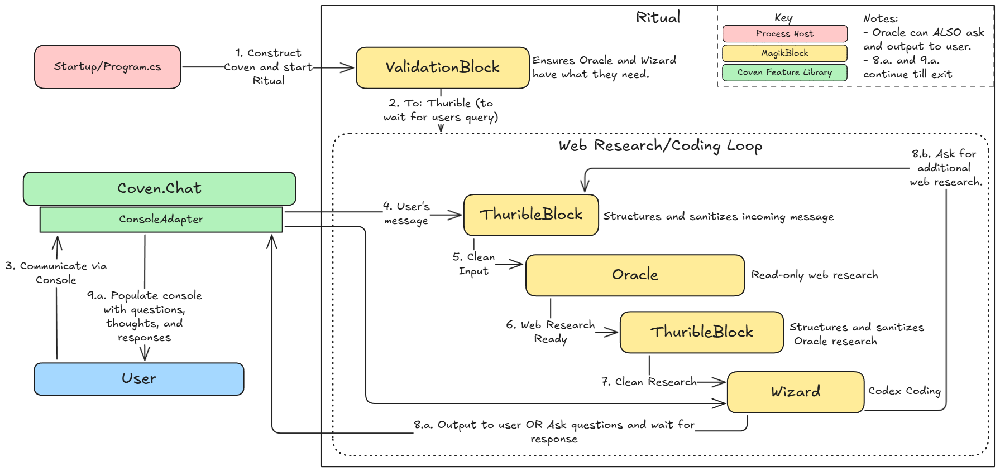

# Sample 01 — LocalCodexCLI

A minimal, end‑to‑end sample that demonstrates **the “standard” Coven way** to route messages between cooperating agents, with conversation flowing in and out through chat adapters. It’s intentionally small, readable, and opinionated so it can double as living documentation for future samples.

> **What you’ll learn**
>
> - How to compose a workflow with `ICoven.Ritual<TIn, TOut>`  
> - How to model agent pipelines with **MagikBlocks**, tags/capabilities, and DI  
> - How a **Wizard** (local coding agent) cooperates with an **Oracle** (research agent)  
> - How to structure **Guidebooks**, **Spellbooks**, and **Testbooks**  
> - How to sanitize inputs/outputs with **ThuribleBlocks**  
> - How chat *adapters* connect user conversation to the Ritual

Coven, at its core, is a .NET engine for orchestrating multiple AI coding agents (“**MagikBlocks**”) that collaborate in a shared context; routing is decided at runtime by tags/capabilities. Configuration is built fluently and becomes immutable at `.Done()`; a **Board** runtime posts/consumes work and supports both push/pull modes.

---

## Mental Model

### Message Flow (high level)



- **Ritual** builds this pipeline, but it is **not** the I/O entry point. Chat adapters (console, Discord, etc.) bring messages in and emit responses out.
- **Routing** between Wizard and Oracle is a function of *capabilities* and *tags* on blocks; where ties exist, registration order breaks ties.

---

### Files
Think of this as a mental model for building with Coven.
- MagikUsers live in their own individual folders.
- If you need to override a MagikUser's context, include the customization in their folder.
- Keep Program.cs as the DI root; It enables seeing the 1000ft view at a glance.

```
samples/
  01.LocalCodexCLI/
    README.md   <-- This file
    Program.cs
    Wizard/
      Wizard.cs
      Wizard.Validation.cs
      PreferenceGuidebook.cs      // Uses shared storage to persist per-user preferences
      CodingSpellbook.cs          // Ask, WebResearch, ReadFile, PatchFile, RunTests
      DeltaTestbook.cs            // {placeholder: what deltas/tests are generated?}
    Oracle/
      Oracle.cs
      Oracle.Validation.cs
      WebSpellbook.cs
        SearchGuidebook.cs
  01.LocalCodexCLI.Tests/
    {tests for all of the above}

```
---

### Blocks (detailed)

**ValidationBlock (Wizard and Oracle)**  
A lightweight pre‑block that validates and configures system dependencies.
- `Wizard.Validation.cs` typically checks `{placeholder: e.g., repo path exists, permissions, prompt schema}`  
- `Oracle.Validation.cs` typically checks `{placeholder: e.g., query min length, URL allowlist, rate limiting hints}`

**Wizard**  
A wrapper for the **local coding agent** (Codex CLI by default) that:
- Accumulates **Context** as the conversation evolves (permissions, books, working directory).  
- **Stays resident** until it (a) exits, (b) errors, or (c) **delegates to research**.  
- Demonstrates **waiting for user approval/permission** before mutating code.

**Oracle (Query, OUT Context)**  
An **internet research agent** that uses `WebSpellbook` tools (HTTP fetch, site search, parsing helpers) to pull data **quickly and safely**. Emits a machine‑digestible `Context` document that the Wizard can consume in its next turn.

**ThuribleBlock (λ wrapper + audit)**  
A focused lambda block with added tracing/telemetry.

**Context sanitizer** — takes Oracle’s context payload; strips/escapes any active content (HTML/JS/ANSI), normalizes citations; emits a plain `string` suitable for the Wizard.

**Query sanitizer**  — takes plain text from the Wizard or user and sanitizes it. It then structures it as a `Query` for the Oracle.


> Under the hood the DI **MagikBuilder** composes these as **MagikBlocks**; tags/capabilities control which registration is selected at runtime. Configuration is frozen at `.Done()`.

---

## Building & Using

### Prerequisites

- **.NET SDK** We use dotnet 10
- **Codex CLI** (local coding agent)  
  - Install via npm:  
    ```bash
    npm install -g @openai/codex
    ```  
  - or via Homebrew (macOS):  
    ```bash
    brew install codex
    ```  
  - Or download a platform binary from the latest release and place `codex` on your `PATH`.
- **Authentication for Codex CLI**  
  - Recommended: sign in with your Chat tool plan from the CLI prompt.  
  - Alternative: use an API key with additional setup; MCP is supported via `~/.codex/config.toml` if you want to expose more tools.
- **Oracle’s LLM / API keys**  
  - `{placeholder: OPENAI_API_KEY or other model provider key(s) required for Oracle summarization/rewriting?}`  
  - `{placeholder: any search API keys (e.g., SERP/Bing) if WebSpellbook uses them?}`

> **Note**: Ensure `codex` is on your `PATH`, or pass an explicit path when constructing the agent.

### Restore, build, run

From the repo root:

```bash
# Build just this sample
dotnet build samples/01.LocalCodexCLI/01.LocalCodexCLI.csproj

# Run the sample
dotnet run --project samples/01.LocalCodexCLI/01.LocalCodexCLI.csproj
```

Alternatively:
```bash
# Open in vscode, f5 builds and runs in debug mode.
# Requires vscode and C# Dev Kit
code samples/01.LocalCodexCLI/
```

When the console starts:
1) Type a goal like *“Add a `--dry-run` flag to the CLI and write tests”*.  
2) The Wizard or Oracle may ask for **approval** before taking action.  
3) If the Wizard needs background knowledge, it will **invoke Oracle**, then continue once a sanitized `Context` returns. 
4) Exit by typing `{placeholder: exit command (e.g., /exit or Ctrl+D)?}`

### Tests
The tests cover: validation logic, thurible sanitization, Wizard “ask/apply” loop, Oracle fetch & context normalization, and end‑to‑end Ritual happy path. `{placeholder: add any golden path/regression IDs}`

Running
```bash
# Run all sample tests. Uses samples/Directory.Packages.props for package versions.
# We default to moving all samples automatically to the latest pre-release before merging to main.
dotnet test samples/Coven.Samples.sln
```

---

## Key Concepts in This Sample

### ICoven & Ritual

- `ICoven` is built via DI and exposes `Ritual<TIn, TOut>(TIn input, CancellationToken ct = default)` to **run a composed pipeline**.  
- In this sample the **Ritual** is started alongside the host and then accepts input via the adapter. This ensures I/O binding remains **outside** the agent logic. See the repo’s Quick Start for the idiomatic DI + coven composition pattern.

### Guidebooks, Spellbooks, Testbooks
Think of these as the way to shape HOW your agent takes action.

- **PreferenceGuidebook** — reads/writes a **shared storage segment** keyed by `{userId}` to persist preferences (style, risk tolerance, test level). `{placeholder: storage abstraction name (e.g., ISharedStore) and where it’s registered}`  
- **CodingSpellbook** — operational tools available to the Wizard:
  - `Ask` — Wizard asks user for approval or clarification (non‑destructive).
  - `WebResearch` — Wizard requests Oracle research when it detects knowledge gaps.
  - `ReadFile` — non‑destructive file read in the current repo workspace.
  - `PatchFile` — applies an approved diff/patch with Codex CLI’s guardrails.
  - `RunTests` — runs tests in an approved sandbox; feeds results back.
- **DeltaTestbook** — produces a set of tests that must pass in order to validate the current deltas from main

- **WebSpellbook** (Oracle) — tools for remote retrieval: HTTP GET, site search, content extraction, rate limiting, and safety checks `{placeholder: list the concrete operations your implementation exposes}`  
- **SearchGuidebook** — prompts and heuristics for building high‑signal queries; also defines policy like “prefer official docs over blogs,” etc. `{placeholder: add your search policy points}`

> Testbooks are a critical abstraction if you have an agent make permanent changes to data.
> When an agent makes a change, leverage the testbook to automatically validate that the change doesn't break existing necessary functionality.

---

## Configuration & Extensibility

### Overriding configuration (the Coven way)

Coven encourages configuration by **composition + tags**, frozen at `.Done()`:

```csharp
services.BuildCoven(b =>
{
    // Register Wizard twice with different tags / input types
    b.AddBlock<string, string, Wizard>(tags: new("wizard","apply"));
    b.AddBlock<InboundMessage, string, Wizard>(tags: new("wizard","chat"));

    // Prefer Oracle from certain domains (capabilities)
    b.AddBlock<Query, Context, Oracle>(capabilities: new("web","fast","safe"));

    // Add extra sanitizer rule
    b.AddBlock<Context, string, ThuribleContext>(tags: new("sanitize","oracle"));

    // Registration order acts as tiebreaker
    b.Done();
});
```

- Use **tags** to influence routing; add/remove blocks without rewriting call sites.  
- Compose additional **Books** by registering them in DI and injecting into blocks.  
- Keep *I/O adapters* separate from Ritual so you can swap them freely. (See below.)  
- See the root README for the MagikBlock/MagikBuilder/Board model.

### Adapter choices

This sample ships with a simple **Console adapter** `{placeholder: class name}`. To swap adapters:

- **Discord adapter**
  1) Add `{placeholder: package name, e.g., Coven.Adapters.Discord}`.
  2) Configure `{placeholder: DISCORD_BOT_TOKEN}` via user secrets or env vars.
  3) Register the Discord adapter as your adapter instead of console.

### Swap Oracle’s model to local

If Oracle uses OpenAI‑compatible APIs, you can aim it at a local endpoint (e.g., `http://localhost:11434/v1`) by setting `{placeholder: ORACLE__OPENAI__BASE_URL}` and, if needed, `{placeholder: ORACLE__OPENAI__API_KEY}` to a dummy token. Adjust temperature, max tokens, etc., via `{placeholder: config section path}`.

> If you keep the Wizard on **Codex CLI**, nothing else changes—Codex is its own local agent process with sandboxing and approvals.

### Load MCP tools as an expanded Spellbook

Codex CLI supports **Model Context Protocol (MCP)**. Define MCP servers in `~/.codex/config.toml`, and Codex will surface those tools to the Wizard. Remember, expose only the minimal set you trust.

---

## Safety & Approvals

- **Sanitization**: All user text and remote content pass through **Thurible** before any agent consumes it.
- **Guardrails**: The Wizard’s mutating operations (file edits, test runs) require explicit user approval; Codex CLI enforces sandboxing and approval modes.  
- **Networking**: Oracle’s WebSpellbook should respect domain allow/deny lists and timeouts `{placeholder: point to config keys}`.

---

## Troubleshooting

- **`codex` not found** — Ensure it’s on your `PATH` or specify `ExecutablePath` when constructing the `CodexCliAgent`.  
- **Auth prompts** — Launch `codex` once and complete sign‑in; or configure API key as described in the Codex README.  
- **No research results** — Check Oracle’s API keys and network connectivity; verify `SearchGuidebook` minimum query length `{placeholder}`.
- **Edits refused** — Confirm permission mode in **PreferenceGuidebook** and Codex approval settings `{placeholder}`.

---

## Appendix

- **Open all samples**: `samples/Coven.Samples.sln` (browse samples side‑by‑side).  
- **Architectural overview**: see `/Architecture/EndToEndExample.md` and the root README for MagikBlock, MagikBuilder, and Board.

---

### Notes for maintainers

- Keep this sample **small and canonical**—prefer to link to richer samples rather than growing this one.  
- When adding a block, document: *input type*, *output type*, *capabilities/tags*, *failure behavior*, and *telemetry*.  
- Prefer **Thurible** wrappers for any transformation that touches free‑form text.  
- Update `{placeholder}`s as internals solidify: storage interfaces, adapter contracts, config keys, and the exact .NET target framework.
